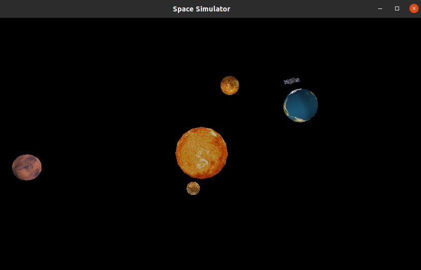

# Space Simulator

## OpenGL

OpenGL este prescurtarea de la Open Graphic Librarie, si reprezinta o specificatie standard care defineste o aplicatie cross-platform API (application programming interface) foarte utilizat pentru programarea componentelor grafice 2D si 3D ale programelor de calculator. Interfata consta in peste 250 de apeluri diferite care pot fi folosite pentru a desenta scene 3D complexe din primitive simple. OpenGL a fost dezvoltat de Silicon Graphics Inc. (SGI) in 1992 si este foarte utilizat in softuri CAD, realitate virtuala, visualizare stiintifica, simulari de zboruri sau jocuri pe calculator. Acest ultim domeniu este in stransa competitie cu tehnologia DirectX de la Microsoft.

## JOGL(Java OpenGL)

Java OpenGL (JOGL) este o bibliotecă de încapsulare care permite utilizarea OpenGL în limbajul de programare Java(wrapper library). A fost inițial dezvoltată de Kenneth Bradley Russell și Christopher John Kline și a fost ulterior dezvoltată de către Grupul de Tehnologie pentru Jocuri al Sun Microsystems. Din 2010, a devenit un proiect independent open-source sub licența BSD. Este implementarea de referință pentru Java Bindings for OpenGL (JSR-231).

JOGL permite accesul la majoritatea funcționalităților OpenGL disponibile în programele scrise în limbajul C prin utilizarea Java Native Interface (JNI). Oferă acces atât la funcțiile standard GL*, cât și la funcțiile GLU*; totuși, biblioteca OpenGL Utility Toolkit (GLUT) nu este disponibilă pentru apeluri legate de sistemul de ferestre, deoarece Java are propriile sisteme de ferestre: Abstract Window Toolkit (AWT), Swing și unele extensii.

### Functii standard GL*

- glBegin/glEnd: Aceste funcții marchează începutul și sfârșitul definirii unei primitive geometrice, cum ar fi un punct, o linie sau un triunghi. Între ele, se specifică punctele și atributele necesare pentru desenarea primitivelor.

- glVertex*: Aceste funcții sunt utilizate pentru a specifica coordonatele unui punct în spațiul 3D. Există mai multe variante ale acestei funcții, cum ar fi glVertex2f pentru coordonate 2D și glVertex3f pentru coordonate 3D.

- glColor*: Aceste funcții sunt utilizate pentru a specifica culoarea primitivelor desenate. Există diferite variante ale acestei funcții pentru a specifica culori în diferite formate, cum ar fi glColor3f pentru specificarea culorii utilizând componente RGB.

- glTranslatef/glRotatef/glScalef: Aceste funcții sunt utilizate pentru a transforma matricea modelului, permițând translatarea, rotirea și scalarea obiectelor în spațiul 3D.

- glClear: Această funcție este utilizată pentru a șterge bufferul de culoare și bufferul de adâncime, pregătind astfel scena pentru desenarea unui nou cadru.

- glViewport: Această funcție este utilizată pentru a specifica regiunea de vizualizare pe ecran. Aceasta definește dimensiunea și poziția ferestrei de vizualizare a rezultatelor grafice generate de OpenGL.

#### Clasele Main, MyCanvas, Planet, Sun
#### Clasa Main

Această clasă "Main" creează o fereastră în care se va afișa canvasul si fereastra de baza.

#### Clasa MyCanvas

GLEventListener - OpenGL rendering pentru GLAutoDrawable

**Obiectele** sunt create **glu.gluSphere** și **glu.gluCylinder** care utilizează primitivele **OpenGL GL_TRIANGLES** și **GL_QUADS** pentru a desena sfere și cilindri. 

- private *FPSAnimator* animator: Animatorul pentru simulare, care se ocupă de actualizarea și redarea constantă a ferestrei.
- private GLU *glu*: Obiect GLU (OpenGL Utility Library) se ocupa de geometrie și texturi.
- private Texture earthTexture și private Texture solarPanelTexture: Texturile utilizate pentru a incarca sfera Pământului și panourile solare ale satelitului.
- private ArrayList<Planet> planets: O listă de obiecte Planet care reprezintă planetele sistemului solar.
- Metodele init, dispose, display și reshape implementează comportamentul specific.
- Metodele drawEarthAndSatellite, drawEarth și drawSatellite desenează sfera Pământului, satelitul și panourile solare, utilizând metode și funcții OpenGL specifice pentru geometrie și texturi.
- Metoda *getObjectTexture* încarcă o textură dintr-un **fișier** și returnează **obiectul Texture** corespunzător.

#### Clasa Planet

Clasa Planet este responsabilă de desenarea și afișarea unui obiect planeta.

Constructorul Planet primește ca parametri un context OpenGL (GL2), un obiect GLU (GLU), o textură pentru planetă (Texture), viteza de rotație (speed), distanța față de origine (distance) și raza planetei (radius).

Metoda display este apelată pentru a afișa obiectul planetă. În cadrul acestei metode:

    - Se salvează starea curentă (gl.glPushMatrix()) pentru a evita interferențe cu alte obiecte desenate în aceeași scenă.
    - Se calculează poziția planetelor în funcție de unghiul și distanța specificate. Coordonatele x și y sunt calculate pe baza unui unghi în raport cu  distanța față de origine, în timp ce coordonata z este setată la 0.
    - Se translează coordonatele de desenare la poziția calculată (gl.glTranslatef(x, y, z)).
    - Se apelează metoda draw pentru a desena planetele
    - Se revine la starea anterioară a gl.glPopMatrix().

Metoda draw este responsabilă de desenarea efectivă a obiectului planetă. În cadrul acestei metode:

    - Se setează proprietățile materialelor pentru a defini aspectul obiectului.
    - Se activează și se adauga textura planetei.
    - Se calculează unghiul de rotație pentru planetă.
    - Se salvează starea curentă a matricei (gl.glPushMatrix()) pentru a evita interferențe cu alte obiecte desenate în aceeași scenă.
    - Se rotește obiectul în jurul axelor de coordonate (gl.glRotatef(rotationAngle, 0.2f, 0.1f, 0)).
    - Se utilizează funcția glu.gluSphere pentru a desena o sferă cu textură (utilizând obiectul GLUquadric).
    - Se revine la starea anterioară a matricei (gl.glPopMatrix()).

În OpenGL, matricea de transformare reprezintă o matrice utilizată pentru a transforma coordonatele geometrice ale obiectelor în spațiul de vizualizare. Această matrice poate fi modificată prin apeluri ale funcțiilor OpenGL, cum ar fi glTranslate(), glRotate() și glScale(), pentru a realiza diferite transformări, cum ar fi translația, rotația și scalarea.

#### Clasa Sun

Reprezinta obiectul pentru soare.

**Sun(GL2 gl, GLU glu, Texture sunTexture):** initializeaza o instanta Sun: rendering context, GLU object, texture.

**void display():** Afișează obiectul soare. Setează textura, aplică textura soarelui, actualizează unghiul de rotație și desenează o sferă care reprezintă soarele folosind metoda gluSphere. Soarele se rotește în jurul axei Y în funcție de unghiul de rotație.

##### Bibliografie

[1]https://en.wikiversity.org/wiki/Computer_graphics/2013-2014/Laboratory_agenda
[2]https://www.textures.com/
[3]https://jogamp.org/wiki/index.php/Downloading_and_installing_JOGL
[4]https://jogamp.org/wiki/index.php/Setting_up_a_JogAmp_project_in_your_favorite_IDE
[5]https://jogamp.org/wiki/index.php?title=Main_Page
[6]https://www.tutorialspoint.com/jogl/pdf/jogl_quick_guide.pdf